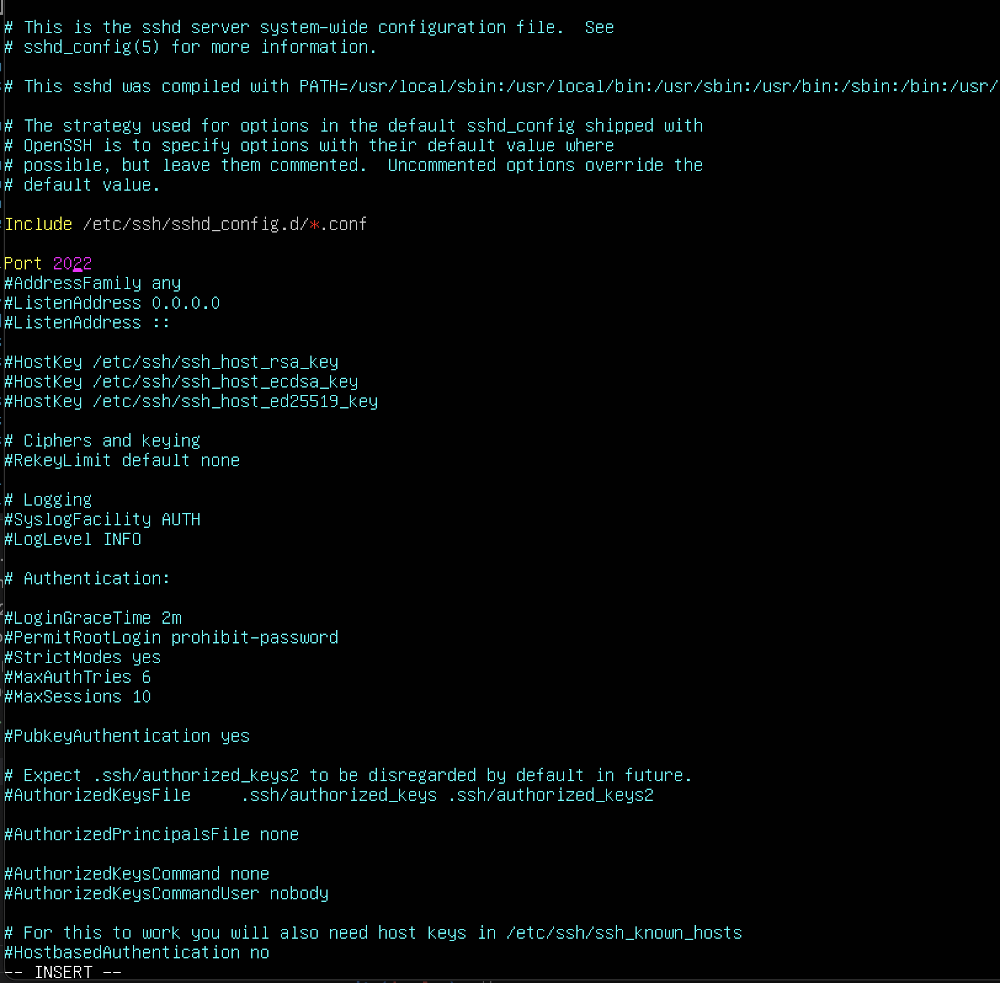
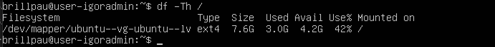

## Part 1. Установка ОС
- 
>Отображает версию ОС

## Part 2. Создание пользователя
- 
>Создание нового пользователя и добавление его в группу 'adm'

## Part 3. Настройка сети ОС
- 
>Задача имя машины вида user-1 и установка временной зоны в соответсвии с текущим местоположением

- 
>Вывод названий сетевых интерфейсов
- lo (loopback device) – виртуальный интерфейс, присутствующий по умолчанию в любом Linux. Он используется для отладки сетевых программ и запуска серверных приложений на локальной машине. С этим интерфейсом всегда связан адрес 127.0.0.1. У него есть dns-имя – localhost. Посмотреть привязку можно в файле /etc/hosts..

- 
>ip адрес устройства от DHCP сервера
- Dynamic Host Configuration Protocol (DHCP) — сетевой протокол, предназначенный для автоматической конфигурации параметров сети на сетевых узлах.

- 
>Внутренний ip адрес шлюза

- 
>Внешний ip адрес

- 
>вручную задаем статичные адреса

- Перезагрузить виртуальную машину. Убедиться, что статичные сетевые настройки (ip, gw, dns) соответствуют заданным в предыдущем пункте.

- 
>пропинговать удаленные хосты 1.1.1.1 и google.com
## Part 4. Обновление ОС
- 
>Обновление системных пакетов до последней версии через apt upgrade

## Part 5. Использование команды sudo
- sudo — это утилита, предоставляющая привилегии root для выполнения административных операций в соответствии со своими настройками. Она позволяет легко контролировать доступ к важным приложениям в системе. 
- 
>предоставляем права root пользователю
- 
>Переключаемся и проверяем права

- 
>меняем имя хоста и проверяем

## Part 6. Установка и настройка службы времени
- 
>синхронизиция времени через файл timesyncd.conf..

## Part 7. Установка и использование текстовых редакторов
- Использованы редакторы Vim, Nano, Joe
_установка: uudo apt install vim_
_sudo apt install nano_
_sudo apt install joe_

_создаем файлы *text_X.txt*_
- 
>Создание файла в vim : vim text_VIM.txt 2) Выйти c сохранениeм(esc) :wq!
- 
>Создание файла в nano : nano text_NANO.txt 2) Выйти c сохранениeм ^+O, ^+X
- 
>Создание файла в joe : joe text_JOE.txt 2) Выйти c сохранениeм ^K+X

_Редактируем файлы но не сохраняем, убеждаемся что пересохранения не было:_
- 
>Выйти без сохранения(esc) :q!
- 
>Выйти без сохранения ^+O
- 
>Выйти без сохранения ^K+Z

- Функции поиска по содержимому файла (слово/cлова), замена:

- 
- 
>найти что-то в файле и заменить в редакторе VIM: %s/find_world/new_rold/g
- 
- 
>найти что-то в файле Cntr+W и заменить Cntr+W & Cntr+R
- 
- 
>найти что-то в файле ^K+F и заменить ^K+F: (R)eplace

## Part 8. Установка и базовая настройка сервиса SSHD

_Установить службу SSHd: sudo apt install openssh-server_
_Проверяем стату службы: systemctl status sshd_

- 
>автостарт службы SSHd

- 
>Перенастроить службу SSHd на порт 2022
>Рестарт сервиса: sudo systemctl restart ssh

- 

- ps - выводит список текущих процессов на сервере. Флаги: -A, -e, (a) - выбрать все процессы; -a - выбрать все процессы, кроме фоновых; -d, (g) - выбрать все процессы, даже фоновые, кроме процессов сессий; -N - выбрать все процессы кроме указанных; -С - выбирать процессы по имени команды; -G - выбрать процессы по ID группы; -p, (p) - выбрать процессы PID; --ppid - выбрать процессы по PID родительского процесса; -s - выбрать процессы по ID сессии; -t, (t) - выбрать процессы по tty; -u, (U) - выбрать процессы пользователя.

- Перезагрузить систему: sudo reboot

_Установим netstat: sudo apt install net-tools_
- 
>Вывод команды netstat -tan

- -a - Отображение всех подключений и ожидающих портов. -n - Отображение адресов и номеров портов в числовом формате. -t - Отображение текущего подключения в состоянии переноса нагрузки с процессора на сетевой адаптер при передаче данных ( "offload" ). 0.0.0.0 означает, что подключение может быть выполнено с/на любой адрес LISTEN - готовность к установке соединения

## Part 9. Установка и использование утилит top, htop

- 
>Вывод комынды top
  * uptime = 24 min
  * количество авторизованных пользователей 1
  * общая загрузка системы - load avarage
  * общее количество процессов - tasks
  * загрузка cpu - %Cpu(s)
  * загрузка памяти - MiB mem

- 
>pid процесса занимающего больше всего памяти Shift+m

- 
>pid процесса, занимающего больше всего процессорного времени Shift+p

- 
>Вывод htop с ссортировкой по PID, PERCENT_CPU, PERCENT_MEM, TIME

- 
>отфильтрованному для процесса sshd

- 
>с процессом syslog, найденным, используя поиск

- 
>с добавленным выводом hostname, clock и uptime

## Part 10. Использование утилиты fdisk

- 

## Part 11. Использование утилиты df

- 
>Вывод команды df /
  * размер раздела - 7,865,580
  * размер занятого пространства - 3,063,896
  * размер свободного пространства - 4,380,616
  * процент использования - 42%
  * единицa измерения в выводе - Kb

- 
>Вывод команды df -Th /
  * размер раздела - 7.6Gb
  * размер занятого пространства - 3.0Gb
  * размер свободного пространства - 4.2Gb
  * процент использования - 42%
  * единицa измерения в выводе - Gb

## Part 12. Использование утилиты du

- 
>размер папок /home, /var, /var/log (в байтах, в человекочитаемом виде)

- 
>размер всего содержимого в /var/log (не общее, а каждого вложенного элемента)

## Part 13. Установка и использование утилиты ncdu
_Установка: sudo apt install ncdu_

- 
>размер /home /var

- 
>размер /var/log

## Part 14. Работа с системными журналами

- 
>время последней успешной авторизации, имя пользователя и метод входа в систему.

- 
>перезапуск sshd service ssh restart

## Part 15. Использование планировщика заданий CRON

>с помощью команды crontab -e задаем задачу, что бы каждые 2 минуты выполнялся скрипт: */2 * * * * uptime

- 
>смотрим в логах записи /var/log/syslog

- 
>список текущих заданий, а затем их удаление